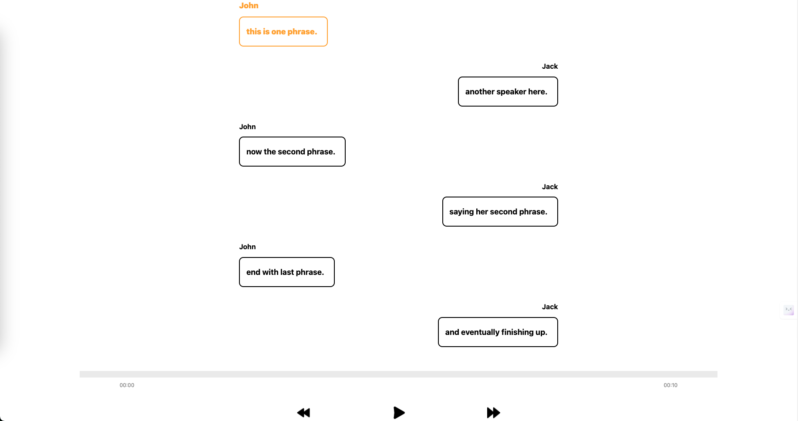
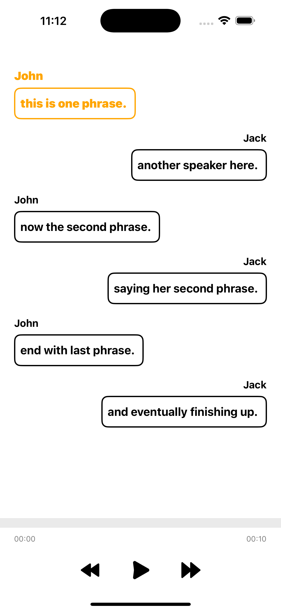

# Audio Player with Transcript Highlighting

## Overview

This is a React Native application that plays an audio file while displaying a transcript. The app highlights the currently spoken phrase in real-time as the audio plays.

> **Note:** I disabled new architecture as it was crashing the app due to react-ntive-track-player. until track player fixes it we have to keep it disabled.

## Features

- **Play:** Start playing the audio from the current position.

- **Pause:** Pause the audio playback.

- **Rewind:** Jump to the beginning of the current phrase (or previous phrase if already at the start).

- **Forward:** Skip to the beginning of the next phrase.

- **Highlighted Transcript:** Displays phrases in order and highlights the current phrase being spoken.

## Running on Web

1- To test it on the web, you'll need to checkout the `rnweb` branch.

2- Ensure you are inside the project directory.

3- Run the following command:

```bash
# using Npm

npm run web

# using Yarn

yarn web
```

### Image



## Running on Android/iOS

- First, you will need to start Metro, the JavaScript bundler that ships with React Native.

- To start Metro, run the following command from the root of your React Native project:

```bash
# using npm
npm start

# OR using Yarn
yarn start
```

- Let Metro Bundler run in its own terminal. Open a new terminal from the root of your React Native project. Run the following command to start your Android or iOS app:

### For Android

```bash
# using npm
npm run android

# OR using Yarn
yarn android
```

### For iOS

```bash
# using npm
npm run ios

# OR using Yarn
yarn ios
```

### Image



### Video

<video width="500" height="500" controls>
  <source src="./src//Assets/Audios/MessageScreen.mp4" type="video/mp4">
</video>

If everything is set up _correctly_, you should see your new app running in your _Android Emulator_ or _iOS Simulator_ shortly provided you have set up your emulator/simulator correctly.

This is one way to run your app — you can also run it directly from within Android Studio and Xcode respectively.

## Modifying your App

Now that you have successfully run the app, let's modify it.

1. Open `App.tsx` in your text editor of choice and edit some lines.
2. For **Android**: Press the <kbd>R</kbd> key twice or select **"Reload"** from the **Developer Menu** (<kbd>Ctrl</kbd> + <kbd>M</kbd> (on Window and Linux) or <kbd>Cmd ⌘</kbd> + <kbd>M</kbd> (on macOS)) to see your changes!

   For **iOS**: Hit <kbd>Cmd ⌘</kbd> + <kbd>R</kbd> in your iOS Simulator to reload the app and see your changes!

## Congratulations! :tada:

You've successfully run and modified your React Native App. :partying_face:

### Now what?

- If you want to add this new React Native code to an existing application, check out the [Integration guide](https://reactnative.dev/docs/integration-with-existing-apps).
- If you're curious to learn more about React Native, check out the [Introduction to React Native](https://reactnative.dev/docs/getting-started).

# Troubleshooting

If you can't get this to work, see the [Troubleshooting](https://reactnative.dev/docs/troubleshooting) page.

# Learn More

To learn more about React Native, take a look at the following resources:

- [React Native Website](https://reactnative.dev) - learn more about React Native.
- [Getting Started](https://reactnative.dev/docs/environment-setup) - an **overview** of React Native and how setup your environment.
- [Learn the Basics](https://reactnative.dev/docs/getting-started) - a **guided tour** of the React Native **basics**.
- [Blog](https://reactnative.dev/blog) - read the latest official React Native **Blog** posts.
- [`@facebook/react-native`](https://github.com/facebook/react-native) - the Open Source; GitHub **repository** for React Native.
